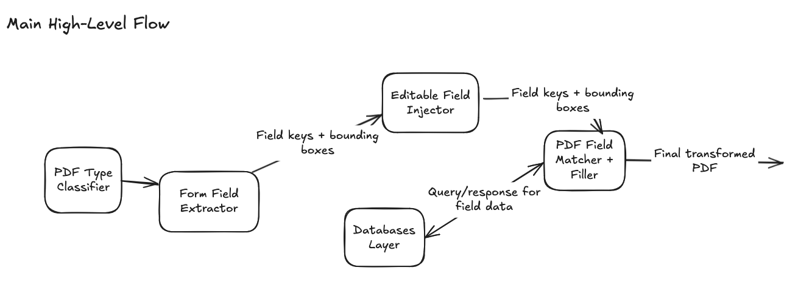
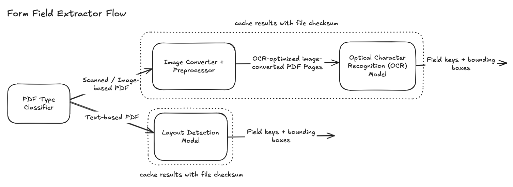
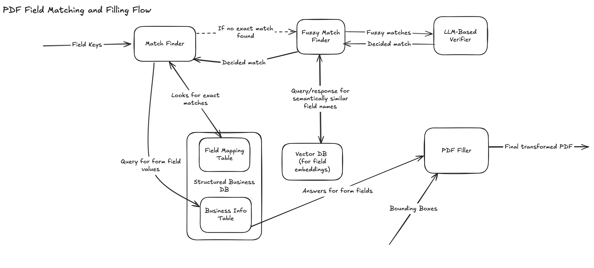

# Agentic Form Filler & JSON Pattern Reducer 

## Section 1: Agentic Form Filler

### Part 1: Conceptual Design

The objective of this component of the project is to design a system that can transform a PDF of unknown fields, structure, and page size into a filled version with labeled, editable fields containing the correct information. 

### Part 2: Web Scraping Solution

## Section 2: JSON Pattern Reducer 