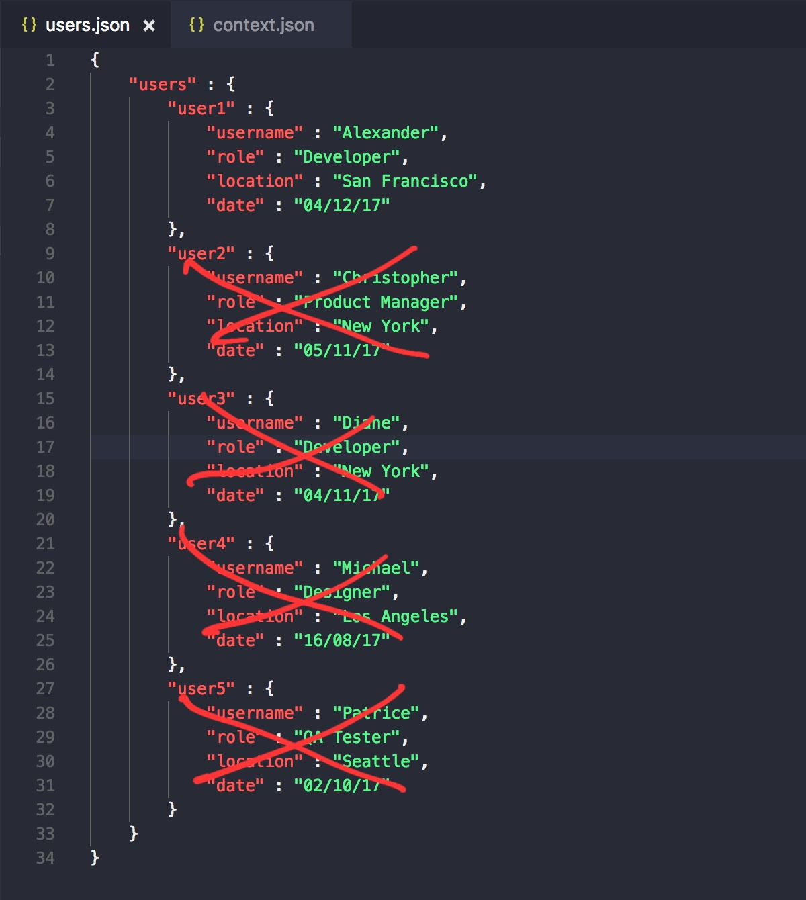

# Agentic Form Filler & JSON Pattern Reducer 

## Section 1: Agentic Form Filler

The purpose of this section of the project is to develop an "Agentic Form Filler" that can process a PDF form and produce a filled version with accurate information.

### Part 1: Conceptual Design

The objective of this part of the project is to design a system that can transform a PDF of unknown fields, structure, and page size into a filled version with labeled, editable fields containing the correct information. 


### Part 2: Web Scraping Solution

The objective of this part of the project is to develop a web scraping solution that automatically extracts all PDFs from the Washington State Department of Revenue website, filters them to identify only those with labeled, editable fields, and fills in the fields with the "correct" answers. 

There are **two components** to this solution. The first performs the scraping and filtering and the second fills in the form fields in the PDFs. 

In order to run the first component, **you must have scrapy, pypdf, os, and urllib installed in your Python environment.** You can then run the first component using the following command in your terminal: 
<br>```scrapy crawl dor_spider```
<br>This will save only PDFs with interactive, editable fields from the Washington State Department of Revenue website. It will save these to the following path: "pdf_scraper/fillable_pdfs"

In order to run the second component, **you must have successfully run the first part of the solution such that there are fillable PDFs in the path "pdf_scraper/fillable_pdfs" and you must have csv, os, pypdf, and pymupdf installed in your Python environment.** You can run the second component using the following command in your terminal:
<br>```python3 fill_pdfs.py```
<br> For this second component, the "correct" answers are filled in using mock data generated by an LLM. This data does not represent any real entities. For any fields that the LLM did not pre-generate answers for, the string "HELLO WORLD" was used as a default answer. Only text boxes are filled in by this script. Checkboxes and other form fields remain unaffected.

*Having issues running the code? 
<br>Make sure you're in the correct directories for running these scripts and that you have the necessary libraries installed. The code has been tested and should work if these requirements are met. For component 1, make sure you are in the top-level "pdf_scraper" directory when you run the spider. For component 2, make sure you are in the top-level directory of this repository.*

## Section 2: JSON Pattern Reducer 

The purpose of this section of the project is to create a script to reduce JSON files to structurally unique patterns. In other words, if this script is given a JSON-like nested structure, it should return a version without any redundant variations of internal structures. So if two internal structures are at the same level of nesting, both should only be kept if they have unique key sets; otherwise, only one should be kept as a representative example of the structure. 

Below is an example of how structures at the same level of nesting that have varied values but the same key sets should be filtered down to only one representative sample:
<br>
<br>

### Running the Script 
Before running the script, **ensure that the following libraries are available in your Python environment: json, hashlibs, collections, and argparse.** Ensure you are at the top level of this repository while running the script and that any json files being used as inputs to the script are in this directory as well. 
The following command should be used to run this script:
<br> ```python3 json_pattern_reducer.py [input_json_file_name].json [output_json_file_name].json```

<br> **There are example json files as well as their reduced counterparts available in this repo (look at texas_articles.json and texas_articles_reduced.json, georgia_codes.json and georgia_codes_reduced.json, and ca_1126.json and ca_1126_reduced.json).** 